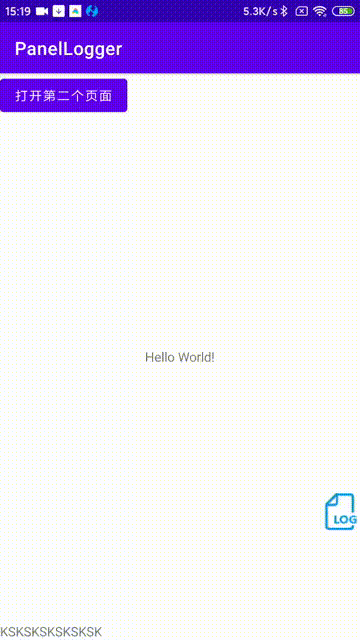

[](https://www.jitpack.io/#landscapeside/PanelLogger)

日志面板--手机上的logcat窗口



特性：

* 支持右滑抽屉式、浮动按钮式以及自定义弹出三种方式打开日志面板
* 支持单击条目后复制至粘贴板
* 分别支持开发版与正式版日志查阅
* 支持通过日志级别、关键字筛选

引入：

```groovy
allprojects {
    repositories {
        ...
        maven { url 'https://www.jitpack.io' }
    }
}
```

```groovy
implementation "com.github.landscapeside:PanelLogger:<version>"
```

使用：

* 全局配置

```xml

// 默认日志上限展示200条，如果需要自定义，需要在AndroidManifest.xml中如下配置

<application .....>
    // 以设置上限100举例，在application节点下配置metadata

    <meta-data android:name="panel_logger_max_size" android:value="100" />

</application>

```

```kotlin
//application的onCreate生命周期里
override fun onCreate() {
    .....
    Logger.showType = FLOAT // 默认DRAWER_SLIDE-右滑抽屉，可选FLOAT-浮动按钮和POP_PAGE-自定义弹出
    .....
}
```

* 输出日志

```kotlin

/*
   * functions for users to record log in PanelLogger
   * a: record assert log
   * v: record verbose log
   * d: record debug log
   * w: record warn log
   * i: record info log
   * e: record error log
   *
   */

Logger.a("test")

Logger.a(IllegalArgumentException("这是一个异常"))

Logger.a(IllegalArgumentException("这是另一个异常"),"一些提示语")

```

* 正式版看日志

在手机上安装[日志查看](app-display-release.apk)


* 混淆配置

```
-keep class com.landside.panellogger.** { *; }

```
